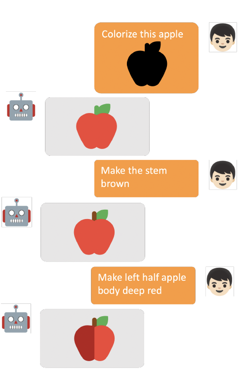
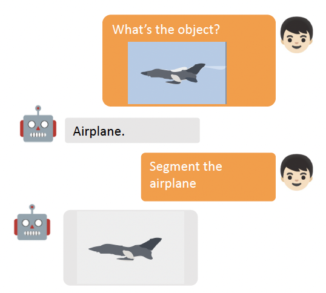
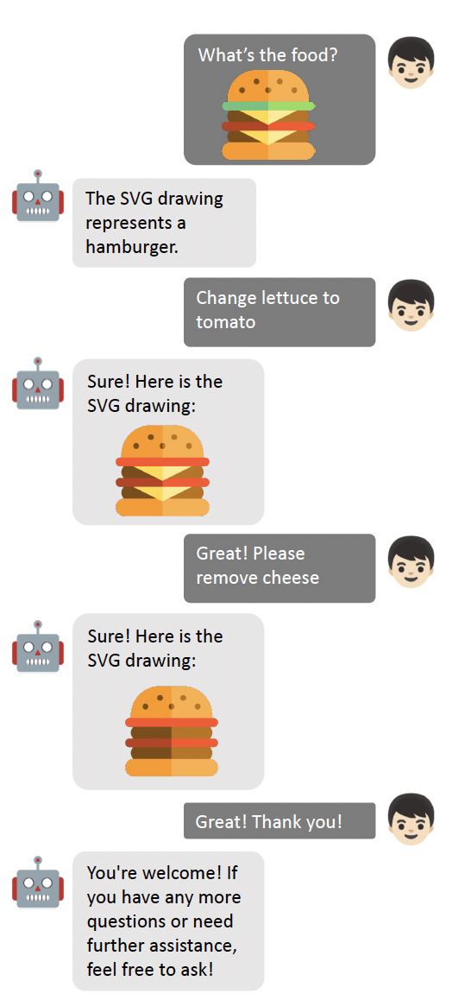
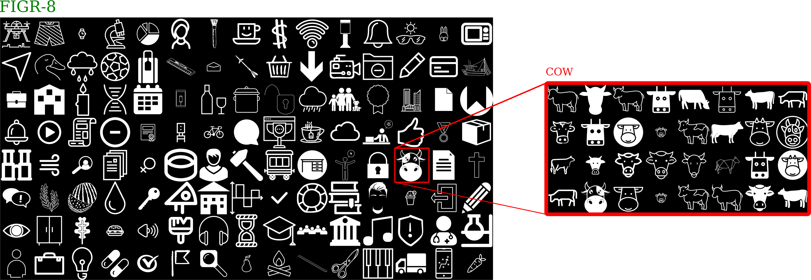

# Approach #1 | Editing SVG elements
    
The system will allow users to edit the SVG UI elements by describing their desired changes in a text format, which will then be interpreted by a chatGPT-like system and applied to the SVG element.

| Technology readiness | Risks | Complexity |
| ----- | ----- | ---------- |
| 🟢 Ready for implementation | 
 🟡 Moderate risk | 
 🟠 Moderately complex |

## Technologies

Following LLM for SVG editing [[Paper](references/research_papers/LLM_for_SVG_Editing.pdf)], the input can be an optimized SVG with text instructions to edit it. The language Model can be tuned on the created target dataset using raster-to-vector tools. 

##  🖼️ Visualization

| Demo #1 | Demo #2 | Demo #3 |
| --- | --- | --- |
| 
  | 
  | 
  |

## Requirements

- ML model: LLM
- SVG optimizer: SVGO [[Github](https://github.com/svg/svgo)]
- Raster-to-vector tool:
    - Vectorisation [[Tutorial](https://blog.thea.codes/raster-vectorization-with-python/)][[Sample code](https://gist.github.com/theacodes/2e13e4e05700279734ca4b34df370adb)]
    - Vtracer [[Github](https://github.com/visioncortex/vtracer)]
- Input: SVG component + text prompt
- Output: edited SVG component

Dataset: Open-source SVG components with text description for finetuning LLM

- Iconify: >150,000 open source SVG icons [[Website](https://iconify.design/)] [[Description](https://iconify.design/docs/icons/icon-data.html)] [[Figma Plug-in](https://www.figma.com/community/plugin/735098390272716381/Iconify)] [[Figma Plug-in Github](https://github.com/iconify/iconify-figma)]
    
- FIGR-8: containing **17,375 classes** of **1,548,256 images** representing pictograms, ideograms, icons, emoticons or object or conception depictions (*with both png and svg format*) [[Github](https://github.com/marcdemers/FIGR-8)]
    
    
    
- SVG Repo: with 500,000+ open-licensed SVG vector and icons [[Website](https://www.svgrepo.com/)]
            

## Relevant works

[Research]

- LLM for SVG editing [[Paper](references/research_papers/LLM_for_SVG_Editing.pdf)]

- LLM for image editing [[Github](https://github.com/IDEA-Research/GroundingDINO/blob/main/demo/image_editing_with_groundingdino_gligen.ipynb)]: GroundingDINO [[Github](https://github.com/IDEA-Research/GroundingDINO)] + GLIGEN [[Github](https://github.com/gligen/GLIGEN)]

- Text prompt for image editing: InstructPix2Pix [[Github](https://github.com/timothybrooks/instruct-pix2pix)]；Prompt-to-prompt [[Github](https://github.com/google/prompt-to-prompt/)]

## Pros and Cons

🟢 Pros

- It could leverage foundation models to understand image content in SVG format
- Provides obvious AI performance on a cross-domain task
- Has sufficient dataset

🔴 Cons

- Generation quality has a risk of not meeting the designer's requirements since there is limited research on SVG generation
- It might be limited on generated detailed SVG components
