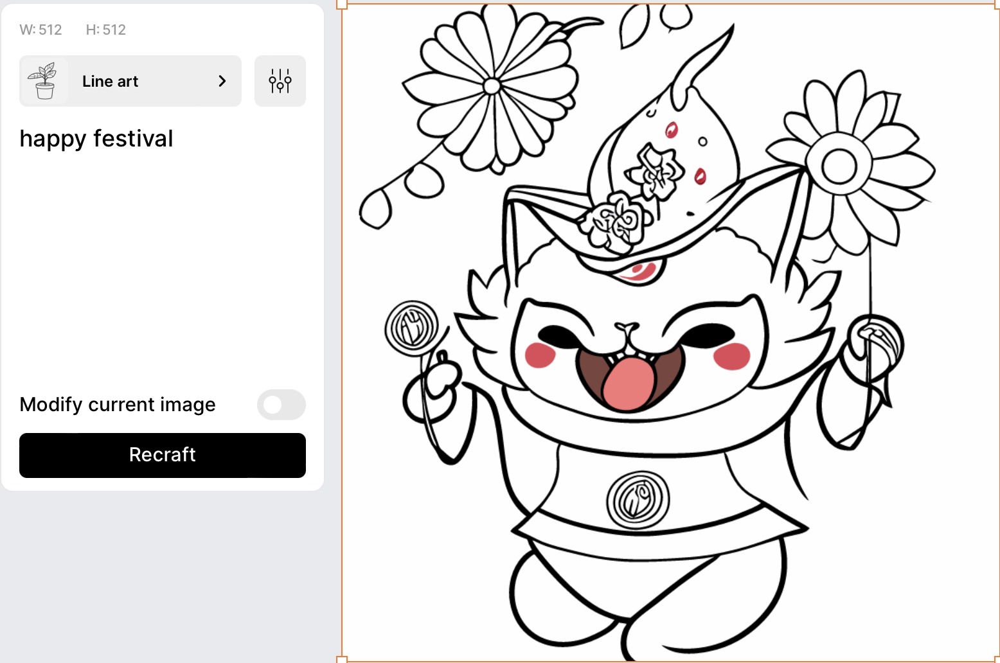
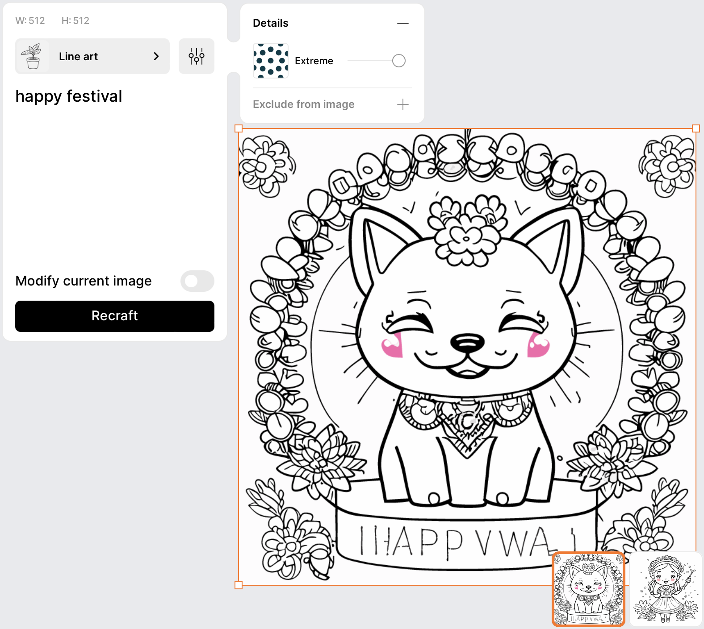
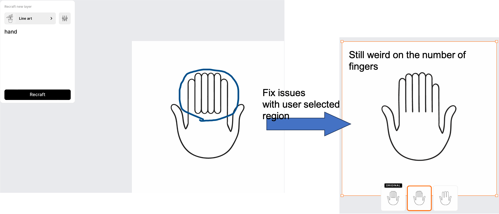
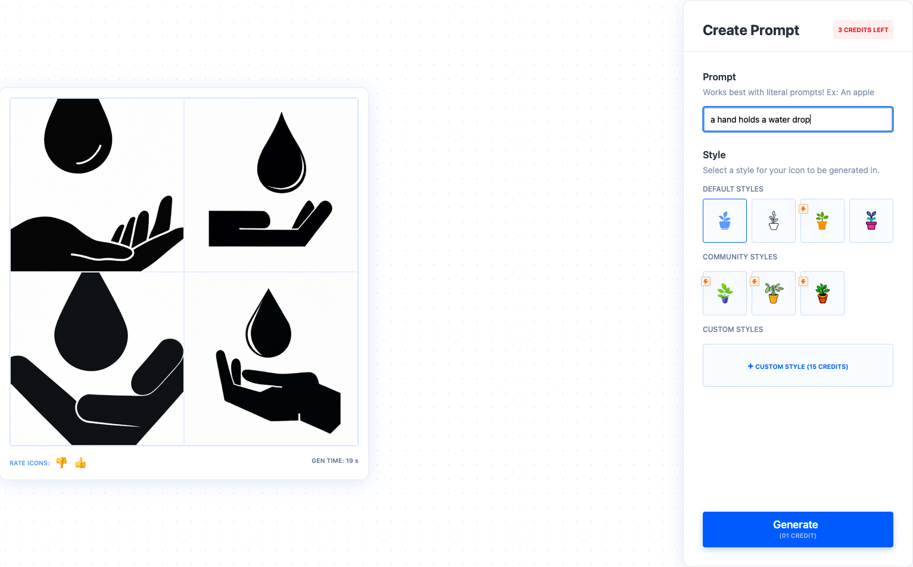

# Approach #2 | New component generation
    
The system will take user input about the desired component and generate a new component based on the text prompt, which will then be interpreted by a chatGPT-like system and applied to the SVG element.

| Technology readiness | Risks | Complexity |
| ----- | ----- | ---------- |
| 
 🟡 Some elements are available, but further development and research needed | 
 🟡 Moderate risk | 
 🔴 Complex |

## Technologies

- Following IconShop [[Paper](references/Research%20papers/IconShop.pdf)]. Based on a transformer-based method to achieve text-to-SVG. The dataset usage is more simple than VectorFusion.
- Following VectorFusion [[Paper](references/Research%20papers/VectorFusion.pdf)]. Prompting stable diffusion -> raster image -> pre-processing (i.e., background removal) -> vectorisation into vector image via Vectorisation [[Tutorial](https://blog.thea.codes/raster-vectorization-with-python/)][[Sample code](https://gist.github.com/theacodes/2e13e4e05700279734ca4b34df370adb)]
or Vtracer [[Github](https://github.com/visioncortex/vtracer)]

## Requirements

- ML model: [IconShop](https://arxiv.org/pdf/2304.14400.pdf) or [VectorFusion](https://ajayj.com/vectorfusion)

Data need:

- Iconify: >150,000 open source SVG icons [[Website](https://iconify.design/)] [[Description](https://iconify.design/docs/icons/icon-data.html)] [[Figma Plug-in](https://www.figma.com/community/plugin/735098390272716381/Iconify)] [[Figma Plug-in Github](https://github.com/iconify/iconify-figma)]
    
- FIGR-8: containing **17,375 classes** of **1,548,256 images** representing pictograms, ideograms, icons, emoticons or object or conception depictions (*with both png and svg format*) [[Github](https://github.com/marcdemers/FIGR-8)]
    
    
    
- SVG Repo: with 500,000+ open-licensed SVG vector and icons [[Website](https://www.svgrepo.com/)]
            

        

## Relevant works

[Research] 

- VectorFusion [[Paper](references/Research%20papers/VectorFusion.pdf)]: text-to-image-to-vector method
- IconShop [[Paper](references/Research%20papers/IconShop.pdf)]: The key to the success of IconShop is to exploit the sequential nature of SVG. Design a transformer-based architecture to achieve text-to-SVG.
    - with black-and-white icon dataset, [FIGR-8](https://github.com/marcdemers/FIGR-8)
- Raster-to-Vector tool: open-source model Vtracer [[Github](https://github.com/visioncortex/vtracer)]

[Business solutions]

Recraft.ai

- References: [[Website](https://www.recraft.ai/)] [[Product Hunt](https://www.producthunt.com/posts/recraft-ai?utm_source=badge-featured&utm_medium=badge&utm_souce=badge-recraft-ai)][[Demo](https://youtu.be/91_i0YcsP0o)]
- Support: (a) text prompt to svg, (b) image modification with prompt, (c) fix issues for user selected region, (d) can specify target styles
- Output format: png, jpg (512x512 & 1024x1024), SVG, Lottie
- **Try some results**: some are awesome; some are not impressive, even in the simple text prompt
    - **Awesome ones**
        
        .png)
        
        
        
        with complex details
        
        
    - **Not impressive ones**
        
        _text_prompt_to_svg.png)
        
        Not impressive one, even in simple prompt “hand”
        
        

iconomy.app

- Reference: [[Try the Demo](https://run.iconomy.app/)]
- 👍 have web UI; the result is acceptable
    
    
    
- 👎 no API; only 5 trys for free

- Adobe Vectorisation [[Website](https://www.adobe.com/express/feature/image/convert/svg)]

## Pros and Cons

🟢 Pros

- Could leverage foundation models to generate decent raster image (if we choose the solution of raster-to-svg)
- Have two state-of-the-art research solutions with different generative architectures for guidance
- Have sufficient dataset

🔴 Cons

- No respective open-source Github repo available for checking the performance of the research paper
- Generation quality has the risk of not meeting the designer's requirements since there is limited research on SVG generation
